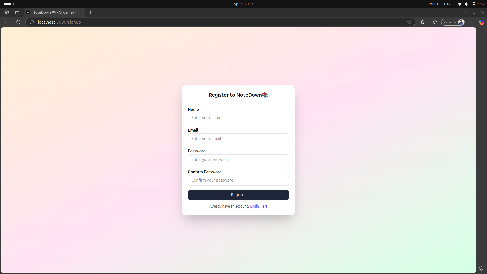
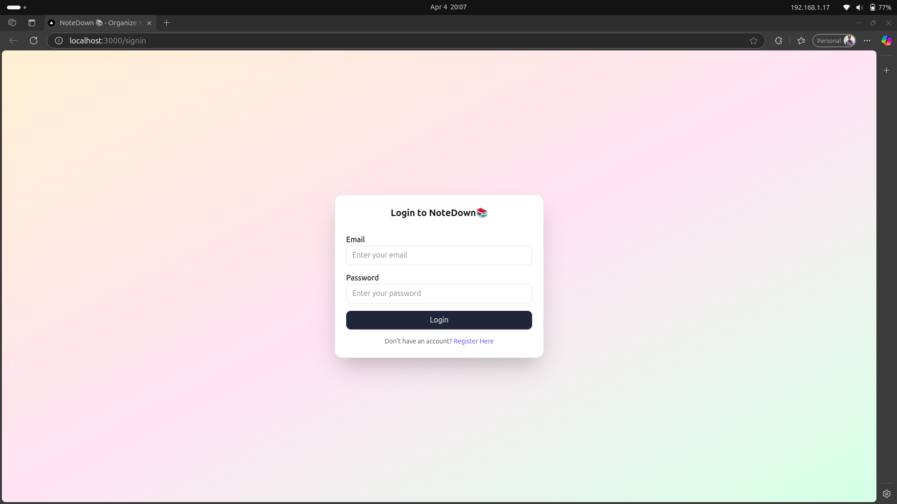
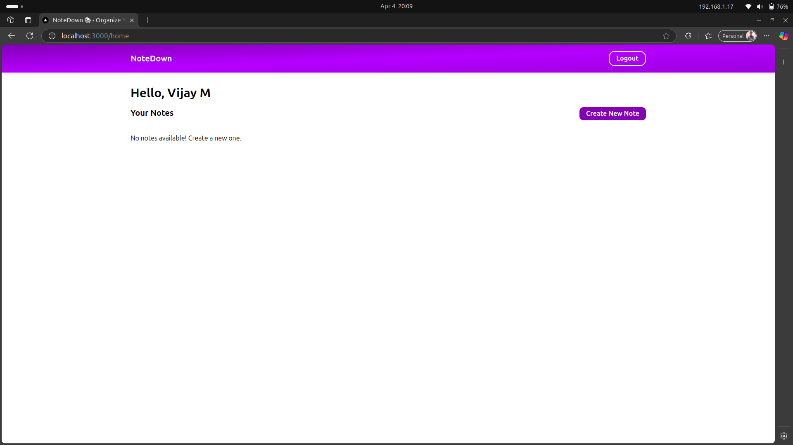
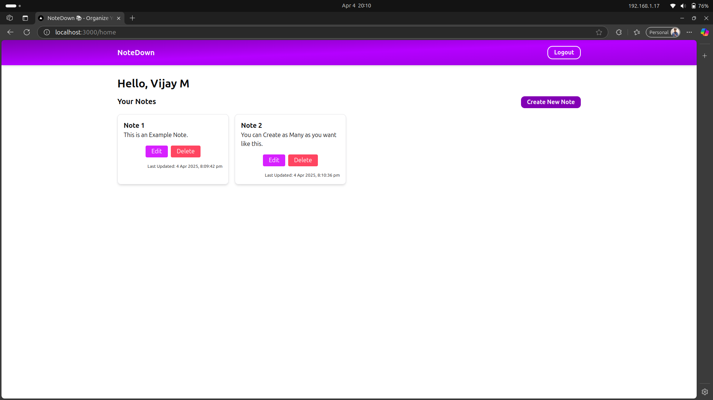
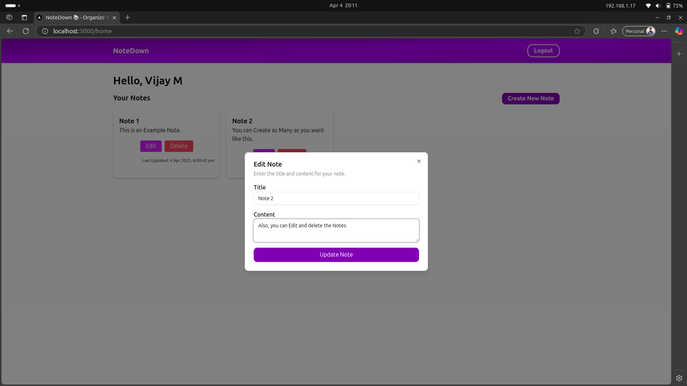

# NoteDown 📚 - An App to Organize Your Thoughts

A powerful notes-taking app to create, edit, and organize your notes efficiently.

## Tech Stack

Tech Stack used in this project:

- Frontend
    + Next JS
    + TypeScript
    + Tailwind CSS
    + shadcn ui for ui elements.
- Backend
    + Python (3.12)
    + Flask
    + pymongo
- Database
    + Mongo DB

## Requirements
- NodeJS (Recommended v20 or above)
- Python (Recommended v3.12)
- Mongo DB / Atlas

## Clone Repository

Clone this repository using the following command
```
git clone https://github.com/vijay-1842/note-down.git
```

## Run this app
> ℹ️ All the commands mentioned in this documentation is compatable for Linux Operating Systems.
### Frontend

Open Terminal in project directory and navigate to the `frontend` directory of the project.
```
cd frontend/
```
Install dependancies
```
npm i
```
> ℹ️ If the above command throws any dependancy error, try again by running `npm i --legacy-peer-deps`. Skip if there is no error.

Run the frontend app
```
npm run dev
```
This command will run the app in `3000` port. Once done, You can use the app by entering `http://localhost:3000` in your browser URL bar.

For production build, run the following command.
```
npm run build
```
This command will create a production build files in `.next` folder inside the `frontend` directory

### Backend

Open Terminal in project directory and navigate to the `backend` directory of the project.
```
cd backend/
```
create a python virtual environment
```
python3 -m venv virtual_environment_name
```

Activate virtual environment
```
source virtual_environment_name/bin/activate
```

Install dependancies
```
pip install -r requirements.txt
```
Run Python app using by `python3 app.py` or `flask run`.


## Example Screenshots

Register Screen



Login Screen



Home Screen





Create Note Modal


Edit Note Modal

